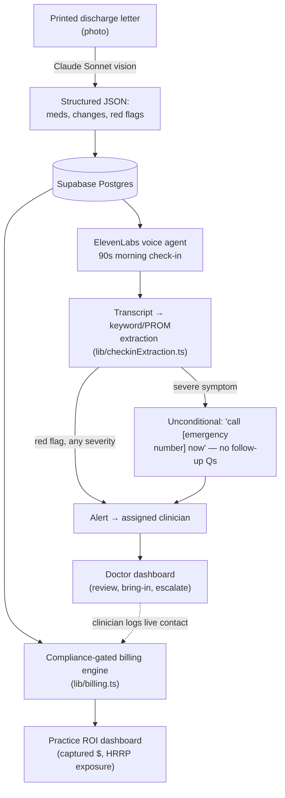

# Discharge Safety Net

**A discharge letter turns into a daily phone call. A red-flag answer turns into a clinician's alert. A completed call turns into billed revenue.**

Built for the Juno Consumer Health Hackathon (institutional pivot). One physician group loses ~$274–372 in TCM/RPM billing per discharge because the 2-day post-discharge contact never happens — not because the care doesn't exist, but because no one calls in time ([research/08-business-model.md](research/08-business-model.md)). This closes that gap: patients get a voice check-in every morning instead of silence until the next appointment; clinicians get a dashboard instead of a stack of unread discharge summaries; the practice gets the billing codes it already qualifies for but usually misses.

## The idea

Post-discharge, most of what goes wrong is not novel — it's a heart failure patient who stopped taking a diuretic, or breathlessness that's crossed from "expected" to "call someone." The gap isn't clinical knowledge, it's **contact**: nobody rings the patient in the 48-hour window CMS requires for TCM billing, and nobody's watching for the one bad morning between the discharge appointment and the follow-up. This product does one thing — daily voice contact with structured escalation — rather than trying to be a general remote-monitoring platform. See [strategy/us-readmissions-thesis.md](strategy/us-readmissions-thesis.md) for why this is now: Apple's 2025 hypertension-notification clearance, CMS's CY2026 RPM rule changes, and FY2027 HRRP expansion to Medicare Advantage all land in the same 18-month window.

## Architecture



Three product surfaces, one data model:

| Surface | Route | What it's for |
|---|---|---|
| **Doctor/nurse dashboard** | `/doctor` | Patient panel, check-in transcripts, PROMs trend, alerts queue, per-patient TCM/RPM billing status |
| **Practice ROI dashboard** | `/practice` | Captured/pending billing, HRRP exposure avoided, enrollment funnel, per-clinician breakdown |
| **Patient portal** | `/patient` | Plain-English discharge plan, medication list, daily check-in |

Full schema and product rationale: [MASTER-PLAN.md](MASTER-PLAN.md) (canonical plan — read this first). [PLAN.md](PLAN.md) and [blocks/](blocks/) hold the original engineering breakdown (letter-parse pipeline, voice mechanics) that MASTER-PLAN.md builds on.

### Stack

Next.js 16 (App Router) on Vercel · Supabase (Postgres + Realtime) · Anthropic API (`claude-sonnet-4-6`, vision + structured JSON) · ElevenLabs Conversational AI · Tailwind v4. All third-party calls run server-side only (`server-only` package enforces this at the type level) — no API key ever reaches client code.

## Safety rails

These are hard requirements, not defaults to be tuned later — see [CLAUDE.md](CLAUDE.md):

1. The system never diagnoses, prescribes, or reassures about symptoms. It notices, explains in plain language, and escalates to a human.
2. On severe symptoms (chest pain, stroke signs, heavy bleeding, breathing difficulty), the only response is *"call [emergency number] now"* plus an urgent alert — no follow-up questions first, no exceptions. The number is looked up from the practice's configured country ([lib/emergency.ts](lib/emergency.ts)) rather than hardcoded, because this is not a single-country product.
3. Every plain-English explanation ends with "check with your pharmacist or GP."
4. No real patient data — demo data only, clearly fictional (Margaret Wilson / Dr. Maria Alvarez).

`lib/checkinExtraction.ts` implements rail #2 directly: a severe-symptom match short-circuits the entire scoring path straight to a `danger` alert before any other signal is considered.

## Where the code quality is

A few things worth pointing a judge at directly, since they're the parts that don't show up in a screen recording:

- **A real billing-compliance engine, not a hardcoded number.** [`lib/billing.ts`](lib/billing.ts) derives `billing_events` from CMS TCM/RPM rules: the 2-day contact window is enforced against the *actual* contact date, not just a done/not-done flag; 99495 vs 99496 is selected from documented medical-decision-making complexity; and — because CMS guidance explicitly excludes "digital assistants such as chat bots, Siri, or Alexa" from qualifying contacts — a billing event can only be marked `captured` if it traces to a clinician-logged **live** contact (phone/video/in-person). An AI-run check-in call can flag a patient; it can never itself generate a billable event. Every rate and rule cites its source in [research/03-reimbursement-codes.md](research/03-reimbursement-codes.md).
- **Structured extraction with a schema, not string-matching on an LLM reply.** [`lib/letterParse.ts`](lib/letterParse.ts) validates the vision model's output against a Zod schema before it ever reaches the database; the system prompt hard-codes safety rails #1 and #3 rather than trusting the model to remember them.
- **Deterministic, auditable check-in triage.** [`lib/checkinExtraction.ts`](lib/checkinExtraction.ts) is a plain keyword/PROM scorer, not a second LLM call — a clinical escalation path should be traceable to an explicit rule, not a black-box inference, and it's the one place false negatives are least acceptable.
- **Auth done properly for what it is.** No per-user accounts for a hackathon demo, but the shared access code is still checked with `timingSafeEqual` and the session cookie is HMAC-signed (`lib/auth.ts`), not a plaintext flag.
- **No invented numbers.** Every statistic on the ROI dashboard traces to a sourced file in [research/](research/) with a confidence rating — HF avoidable-readmission cost ($2,488), general/COPD fallback ($2,140), HRRP average penalty (~$217K, FY2024), TCM/RPM capture (~$274–372/episode) — never blended into one invented "savings" figure. See [research/02-us-hrrp-penalties-costs.md](research/02-us-hrrp-penalties-costs.md).
- **Regulatory-literal wearables layer.** The wearable-signals feature only surfaces discrete, pre-classified events (Apple's cleared hypertension/irregular-rhythm notifications), not raw vitals streams — deliberately, because analyzing raw signal data tips a passive notification feature into FDA SaMD territory. Sourced in [research/06-regulatory-compliance.md](research/06-regulatory-compliance.md).

## Design

Visual language extracted from a Claude Design mock (`.design-ref/`) — an inpatient ICU monitoring layout reused for its *system* (oklch warm-neutral palette with an amber/terracotta primary, Figtree/Inter type pairing, fixed dark sidebar + 3-column grid), not its literal content, since this product is outpatient/post-discharge, not bedside monitoring. Full breakdown in [MASTER-PLAN.md](MASTER-PLAN.md#design-system). The goal was a dashboard a clinician could believe is real software, not a hackathon demo — dense information, calm color use for severity (not alarm-red everywhere), print-formatted billing documents.

## Demo spine (~1 minute)

Printed discharge letter → live photo parse on stage → red flag surfaces → phone rings → patient gives a red-flag answer → clinician's dashboard flags it in real time → clinician clicks "bring them in" → practice dashboard's captured-billing number ticks up. One patient, one call, one escalation, one dollar figure — the whole loop, not a feature tour.

## Repository layout

```
app/              Next.js App Router routes (doctor, practice, patient, settings, login)
components/       React components, grouped by surface (doctor/ practice/ patient/ settings/)
lib/              Server-only logic: letter parsing, billing engine, check-in extraction,
                  emergency-number lookup, Supabase clients, auth
prebuild/         Fixture discharge letters used for the live demo parse
research/         Every sourced statistic used anywhere in this project, with confidence ratings
strategy/         The institutional-pivot thesis and business rationale
blocks/           Original engineering breakdown by build phase (A–H)
.design-ref/      Extracted design-mock reference (visual language source, see Design above)
MASTER-PLAN.md    Canonical current plan — read this first
CLAUDE.md         Project rules for AI-assisted development on this repo (stack, safety rails, research discipline)
```

## Running locally

```bash
npm install
npm run dev
```

Requires a `.env.local` with:

```
SUPABASE_URL=
SUPABASE_ANON_KEY=
SUPABASE_SERVICE_ROLE_KEY=
ANTHROPIC_API_KEY=
ELEVENLABS_API_KEY=
ELEVENLABS_AGENT_ID=
ELEVENLABS_WEBHOOK_SECRET=
ACCESS_CODE=
SESSION_SECRET=
```

`/login` gates every route behind `ACCESS_CODE` so a shared local link isn't wide open. `/settings` has a "reload demo data" action that reseeds the full demo dataset (patients, meds, red flags, check-in history, alerts, billing) from [`lib/demoData.ts`](lib/demoData.ts) — run it before each rehearsal so reviewed alerts don't carry over.

No real patient data exists anywhere in this repo or its demo database — see safety rail #4.
