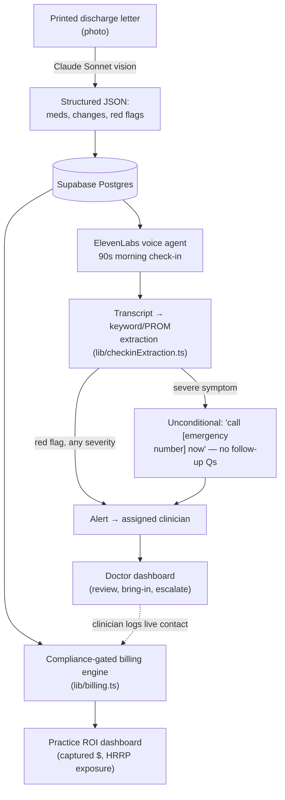
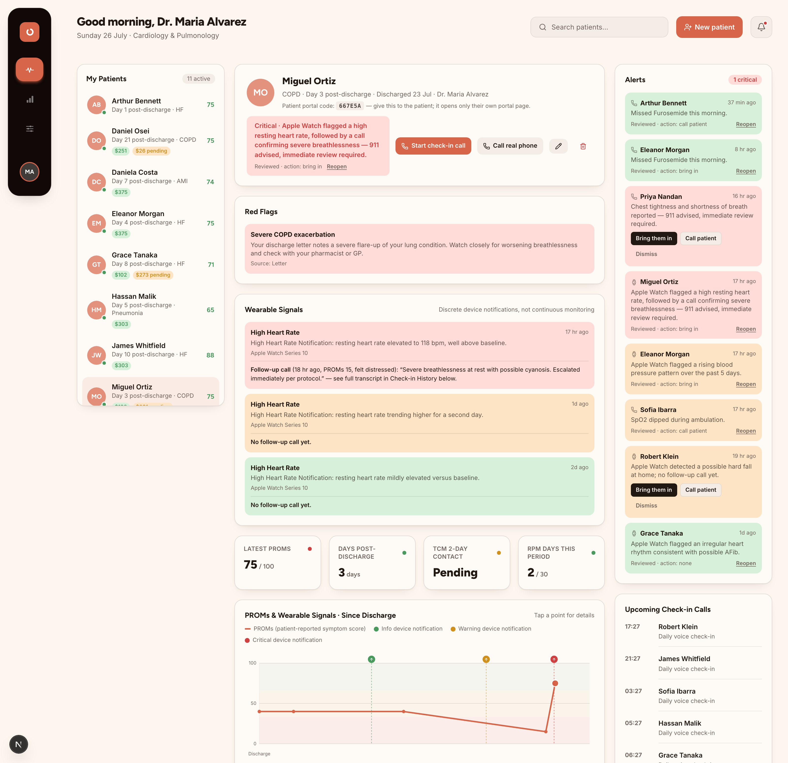
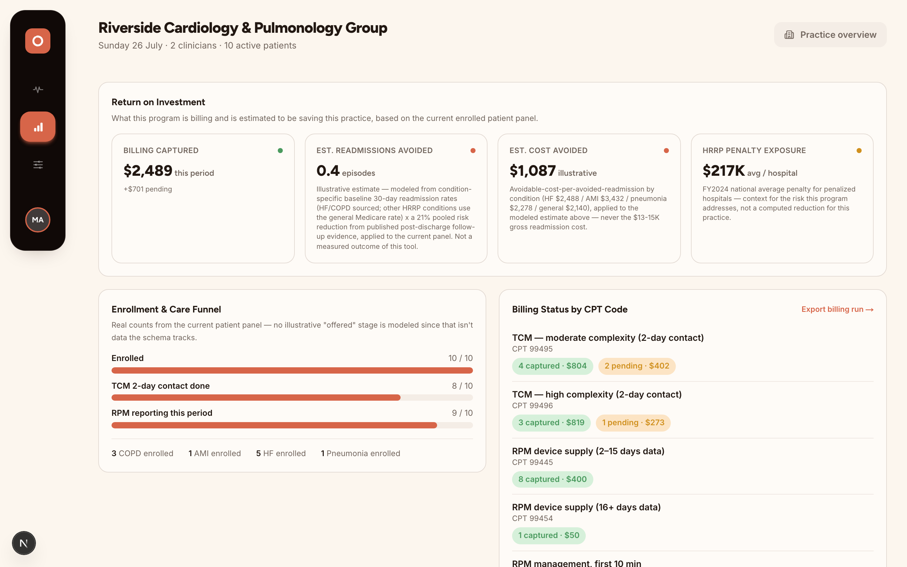
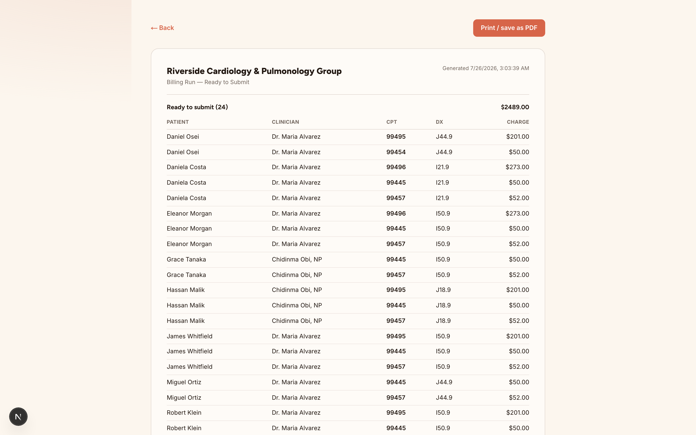
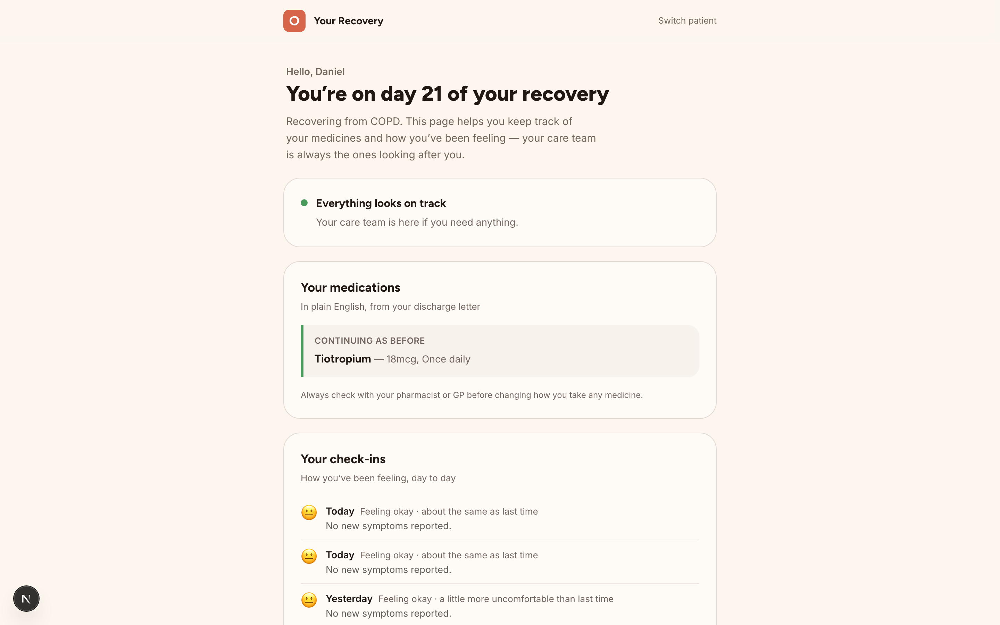
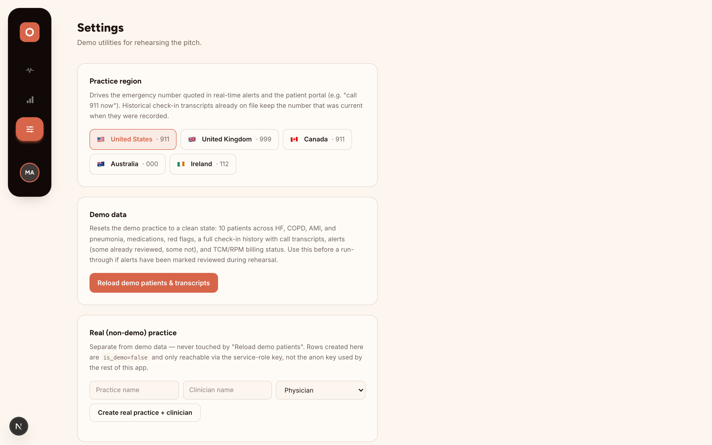

# Recura

**Discharge Safety Net** — a discharge letter turns into a daily phone call. A red-flag answer turns into a clinician's alert. A completed call turns into billed revenue.**

Built for the Juno Consumer Health Hackathon (institutional pivot). One physician group loses ~$274–372 in TCM/RPM billing per discharge because the 2-day post-discharge contact never happens — not because the care doesn't exist, but because no one calls in time ([research/08-business-model.md](research/08-business-model.md)). This closes that gap: patients get a voice check-in every morning instead of silence until the next appointment; clinicians get a dashboard instead of a stack of unread discharge summaries; the practice gets the billing codes it already qualifies for but usually misses.

## The idea

Post-discharge, most of what goes wrong is not novel — it's a heart failure patient who stopped taking a diuretic, or breathlessness that's crossed from "expected" to "call someone." The gap isn't clinical knowledge, it's **contact**: nobody rings the patient in the 48-hour window CMS requires for TCM billing, and nobody's watching for the one bad morning between the discharge appointment and the follow-up. This product does one thing — daily voice contact with structured escalation — rather than trying to be a general remote-monitoring platform. See [strategy/us-readmissions-thesis.md](strategy/us-readmissions-thesis.md) for why this is now: Apple's 2025 hypertension-notification clearance, CMS's CY2026 RPM rule changes, and FY2027 HRRP expansion to Medicare Advantage all land in the same 18-month window.

## Architecture



Three product surfaces, one data model:

| Surface | Route | What it's for |
|---|---|---|
| **Doctor/nurse dashboard** | `/doctor` | Patient panel, check-in transcripts, PROMs trend, alerts queue, per-patient TCM/RPM billing status |
| **Practice ROI dashboard** | `/practice` | Captured/pending billing, HRRP exposure avoided, enrollment funnel, per-clinician breakdown |
| **Patient portal** | `/patient` | Plain-English discharge plan, medication list, daily check-in |

Full schema and product rationale: [MASTER-PLAN.md](MASTER-PLAN.md) (canonical plan — read this first). [PLAN.md](PLAN.md) and [blocks/](blocks/) hold the original engineering breakdown (letter-parse pipeline, voice mechanics) that MASTER-PLAN.md builds on.

### Stack

Next.js 16 (App Router) on Vercel · Supabase (Postgres + Realtime) · Anthropic API (`claude-sonnet-4-6`, vision + structured JSON) · ElevenLabs Conversational AI · Tailwind v4. All third-party calls run server-side only (`server-only` package enforces this at the type level) — no API key ever reaches client code.

## Screenshots

Real screens against the seeded demo dataset (Riverside Cardiology & Pulmonology Group — fictional, see safety rail #4), logged in as `maria.alvarez@demo.recura.health`.

**Doctor dashboard** — the surface a clinician actually lives in. Left: their patient panel (`11 active`, scoped by RLS to whichever clinician is logged in). Center: Miguel Ortiz's chart — a COPD patient 3 days post-discharge with a critical, unreviewed alert (Apple Watch flagged a high resting heart rate, followed by a check-in call confirming severe breathlessness), plus TCM 2-day contact status, RPM reporting days, and a PROMs/wearable-signal trend line, all pulled live rather than hardcoded. Right: the alert queue, color-coded by severity, each traceable to a specific check-in or wearable event and showing who reviewed it and what action they took.



**Practice ROI dashboard** (`/practice`) — the number a physician group actually cares about. Billing captured vs. pending, readmissions/cost avoided (explicitly labeled "illustrative," never blended with the real captured-billing figure), and HRRP penalty exposure as context, not a claimed reduction. Every figure here traces to a sourced file in [research/](research/) — see the [Research library](research/README.md) index and confidence key.



**Billing run, print view** — the output of the actual compliance engine ([`lib/billing.ts`](lib/billing.ts)), not a mocked total. Per patient, per CPT code (99495 vs. 99496 selected from documented medical-decision-making complexity, 99445/99454/99457 for RPM), with the diagnosis code and charge — the kind of document billing staff would actually submit.



**Patient portal** (`/patient/[id]`) — what the patient sees, locked to their own chart via their individual access code. Plain-English medication list and check-in history, in keeping with safety rail #3 ("check with your pharmacist or GP" on every explanation) — no clinical jargon, no dosing advice.



**Settings — practice region** — the control behind safety rail #2. The emergency number quoted in a severe-symptom alert (`"call 911 now"` vs. `999`, `112`, etc.) is looked up from here ([`lib/emergency.ts`](lib/emergency.ts)), not hardcoded to one country, because this is not a single-country product. This screen also holds the "reload demo data" action referenced throughout this README.



## Safety rails

These are hard requirements, not defaults to be tuned later — see [CLAUDE.md](CLAUDE.md):

1. The system never diagnoses, prescribes, or reassures about symptoms. It notices, explains in plain language, and escalates to a human.
2. On severe symptoms (chest pain, stroke signs, heavy bleeding, breathing difficulty), the only response is *"call [emergency number] now"* plus an urgent alert — no follow-up questions first, no exceptions. The number is looked up from the practice's configured country ([lib/emergency.ts](lib/emergency.ts)) rather than hardcoded, because this is not a single-country product.
3. Every plain-English explanation ends with "check with your pharmacist or GP."
4. No real patient data — demo data only, clearly fictional (Margaret Wilson / Dr. Maria Alvarez).

`lib/checkinExtraction.ts` implements rail #2 directly: a severe-symptom match short-circuits the entire scoring path straight to a `danger` alert before any other signal is considered.

## Where the code quality is

A few things worth pointing a judge at directly, since they're the parts that don't show up in a screen recording:

- **A real billing-compliance engine, not a hardcoded number.** [`lib/billing.ts`](lib/billing.ts) derives `billing_events` from CMS TCM/RPM rules: the 2-day contact window is enforced against the *actual* contact date, not just a done/not-done flag; 99495 vs 99496 is selected from documented medical-decision-making complexity; and — because CMS guidance explicitly excludes "digital assistants such as chat bots, Siri, or Alexa" from qualifying contacts — a billing event can only be marked `captured` if it traces to a clinician-logged **live** contact (phone/video/in-person). An AI-run check-in call can flag a patient; it can never itself generate a billable event. Every rate and rule cites its source in [research/03-reimbursement-codes.md](research/03-reimbursement-codes.md).
- **ML is scoped to one job: reading the letter, not deciding what matters.** The only model in the whole escalation path is the vision call in [`lib/letterParse.ts`](lib/letterParse.ts) (`claude-sonnet-4-6`), turning a photographed discharge letter into structured meds/changes/red-flags — and even there its output is validated against a Zod schema before it ever reaches the database, and the system prompt hard-codes safety rails #1 and #3 rather than trusting the model to remember them. That's a deliberate boundary, not an oversight: ML converts unstructured input (a photo) into structured data; it never gets to be the thing deciding whether a patient is at risk.
- **Deterministic, auditable check-in triage — no ML here on purpose.** [`lib/checkinExtraction.ts`](lib/checkinExtraction.ts) is a plain keyword/PROM scorer, not a second model call. A clinical escalation path should be traceable to an explicit rule a clinician can read and challenge, not a black-box inference — this is the one place in the system where false negatives are least acceptable, so it's the one place ML is deliberately kept out.
- **Real per-clinician auth and access control, not a shared password.** Clinicians sign in with individual Supabase Auth accounts (`clinicians.auth_user_id`); Postgres Row Level Security — not app code — decides which patients a session can read or write, via `SECURITY DEFINER` helpers (`current_clinician_id()`, `current_clinician_is_admin()`). A non-admin clinician's queries are scoped to `clinician_id = current_clinician_id()`; only `clinicians.is_admin = true` sees the whole practice. Tested directly: a non-admin session hitting another clinician's `/doctor/[patientId]` URL gets a 404 at the database layer, not a hidden UI element. See [Access control & audit trail](#access-control--audit-trail) below. The patient portal (`/patient`) is intentionally a *separate* mechanism — a real patient never has a clinician account — still gated by a shared access code (`lib/auth.ts`), checked with `timingSafeEqual` and an HMAC-signed session cookie.
- **No invented numbers.** Every statistic on the ROI dashboard traces to a sourced file in [research/](research/) with a confidence rating — HF avoidable-readmission cost ($2,488), general/COPD fallback ($2,140), HRRP average penalty (~$217K, FY2024), TCM/RPM capture (~$274–372/episode) — never blended into one invented "savings" figure. See [research/02-us-hrrp-penalties-costs.md](research/02-us-hrrp-penalties-costs.md).
- **Regulatory-literal wearables layer.** The wearable-signals feature only surfaces discrete, pre-classified events (Apple's cleared hypertension/irregular-rhythm notifications), not raw vitals streams — deliberately, because analyzing raw signal data tips a passive notification feature into FDA SaMD territory. Sourced in [research/06-regulatory-compliance.md](research/06-regulatory-compliance.md).

## Access control & audit trail

Two different actors, two different mechanisms:

| Actor | Routes | Mechanism | Scoping |
|---|---|---|---|
| Clinician | `/doctor`, `/practice`, `/settings` | Supabase Auth (email + password) | Postgres RLS: own patients, or all if `is_admin` |
| Patient (staff/demo) | `/patient` | Shared practice access code | None — opens the picker and any patient |
| Patient (individual) | `/patient/[id]` | That patient's own `access_code` | Locked to exactly one patient — no picker, no other patient's chart, even by direct URL |

The individual patient code (`lib/patientAccessCode.ts`, shown to the clinician on the patient's detail page as "Patient portal code") is the one you'd actually hand to a real patient — it signs into a session cookie scoped to that one `patientId` (`proxy.ts` redirects any other `/patient/*` path, including the bare picker, straight back to their own page). The shared code above is a staff/demo convenience for browsing the whole panel, not something a patient should have.

**Why RLS instead of an app-level `WHERE clinician_id = ...` filter:** an app-level filter only holds if every query remembers to apply it. RLS makes the database itself refuse the row, so a missed filter fails closed instead of leaking data — confirmed above by the 404 test. The demo practice is seeded with one admin (Dr. Alvarez, sees all 10 patients) and one non-admin (Chidinma Obi, NP, sees only her 4 assigned patients) specifically so logging in as each shows a genuinely different, correctly-scoped panel rather than two logins into the same view.

Demo clinician logins (seeded/reset by `lib/clinicianAuth.ts` on every `/settings` → "Reload demo data", password from `DEMO_CLINICIAN_PASSWORD`):

| Email | Role | Admin |
|---|---|---|
| `maria.alvarez@demo.recura.health` | Physician | Yes — sees the whole practice |
| `chidinma.obi@demo.recura.health` | Nurse practitioner | No — sees only her own patients |

Reseeding writes patients under both clinicians' ids, so **run "Reload demo data" while logged in as the admin account** — a non-admin session can't provision rows outside its own scope, by the same RLS that protects real data.

**Audit trail** ([`lib/audit.ts`](lib/audit.ts), `audit_log` table): every patient-detail view and clinical action (alert review, TCM/RPM contact logged, new patient added) is recorded with the real clinician who did it, not the old single hardcoded identity. Logging is best-effort and never blocks the action it describes. A clinician can query their own audit history; only an admin can query everyone's — enforced by the same RLS pattern as patient data.

This is additive to (not a replacement for) the existing TCM/RPM Compliance Log on the patient page, which answers a different question — "was the CMS-required billing contact made" — not "who looked at this chart."

## Design

Visual language extracted from a Claude Design mock (kept locally, not in this repo) — an inpatient ICU monitoring layout reused for its *system* (oklch warm-neutral palette with an amber/terracotta primary, Figtree/Inter type pairing, fixed dark sidebar + 3-column grid), not its literal content, since this product is outpatient/post-discharge, not bedside monitoring. Full breakdown in [MASTER-PLAN.md](MASTER-PLAN.md#design-system). The goal was a dashboard a clinician could believe is real software, not a hackathon demo — dense information, calm color use for severity (not alarm-red everywhere), print-formatted billing documents.

## Demo spine (~1 minute)

Printed discharge letter → live photo parse on stage → red flag surfaces → phone rings → patient gives a red-flag answer → clinician's dashboard flags it in real time → clinician clicks "bring them in" → practice dashboard's captured-billing number ticks up. One patient, one call, one escalation, one dollar figure — the whole loop, not a feature tour.

## Repository layout

```
app/              Next.js App Router routes (doctor, practice, patient, settings, login)
components/       React components, grouped by surface (doctor/ practice/ patient/ settings/)
lib/              Server-only logic: letter parsing, billing engine, check-in extraction,
                  emergency-number lookup, Supabase clients, clinician auth + audit log
research/         Every sourced statistic used anywhere in this project, with confidence ratings
strategy/         The institutional-pivot thesis and business rationale
blocks/           Original engineering breakdown by build phase (A–H)
MASTER-PLAN.md    Canonical current plan — read this first
CLAUDE.md         Project rules for AI-assisted development on this repo (stack, safety rails, research discipline)
```

## Running locally

```bash
npm install
npm run dev
```

Requires a `.env.local` with:

```
SUPABASE_URL=
SUPABASE_ANON_KEY=
SUPABASE_SERVICE_ROLE_KEY=
ANTHROPIC_API_KEY=
ELEVENLABS_API_KEY=
ELEVENLABS_AGENT_ID=
ELEVENLABS_PHONE_NUMBER_ID=
ELEVENLABS_WEBHOOK_SECRET=
ACCESS_CODE=
SESSION_SECRET=
DEMO_CLINICIAN_PASSWORD=
DEMO_RESEED_ENABLED=
```

`/patient` (the patient portal) is gated behind the shared `ACCESS_CODE`, since a real patient never has an individual account. `/doctor`, `/practice`, and `/settings` require a real clinician login — see [Access control & audit trail](#access-control--audit-trail) for the seeded demo credentials. `/settings` has a "reload demo data" action (log in as the admin account first) that reseeds the full demo dataset (patients, meds, red flags, check-in history, alerts, billing, and both clinicians' auth accounts) from [`lib/demoData.ts`](lib/demoData.ts) — run it before each rehearsal so reviewed alerts don't carry over.

### Real phone calls (optional)

By default check-in calls connect via WebRTC straight from the doctor's browser (`components/doctor/CheckinCallButton.tsx`) — no telephony required. To have the agent actually dial the patient's phone instead:

1. In the ElevenLabs dashboard, under Conversational AI → Phone Numbers, provision a number (this is a real purchase — do it there, not something this repo can do for you) and copy its **Phone Number ID** into `ELEVENLABS_PHONE_NUMBER_ID`.
2. Under that agent's settings, add a Post-Call Webhook pointing at `https://<your-deployment>/api/call/webhook`, and copy its signing secret into `ELEVENLABS_WEBHOOK_SECRET`.
3. `POST /api/call/start` with `{ "patientId": "..." }` (session-cookie gated, same as the rest of the app) triggers the real call; the transcript lands in `checkins` via the webhook once the call ends, same extraction/alerting logic as the browser call (`lib/checkinPersist.ts`).

No real patient data exists anywhere in this repo or its demo database — see safety rail #4.
